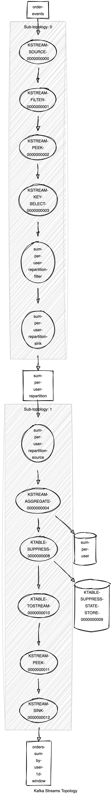

# kafka-streams-starter

This is a starter project for Kafka Streams.
It contains a simple processing example on a ksql-datagen quickstart data (see [data-gen/README.md](data-gen/README.md))

## How to Run

1. use [https://github.com/konfortes/kafka-ecosystem](https://github.com/konfortes/kafka-ecosystem) to spawn all required docker containers (Zookeeper, Kafka, KSqlDB, etc.)

2. Create the source and sink topics:

    ```bash
    foreach topic (order-events orders-sum-by-user-1m-window)
      kafka-topics --create --bootstrap-server localhost:9092 --replication-factor 1 --partitions 1 --topic $topic
    end
    ```

    (Cleanup)

    ```bash
    foreach topic (order-events orders-sum-by-user-1m-window)
      kafka-topics --delete --bootstrap-server localhost:9092 --topic $topic
    end
    ```

3. Run the app: `sbt run`

4. See processed data output

    ```bash
    kafkacat -C -b localhost:9092 -t orders-sum-by-user-1m-window -s key=s -s value=q -f 'Key: %k\nHeaders: %h\nValue: %s\n' -o beginning
    ```

## Topology

</img>
